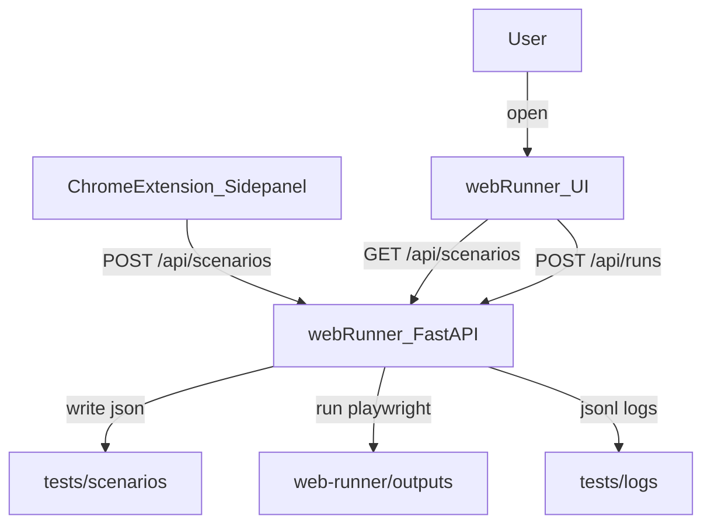

# XPath Helper Pro

**XPath Helper Pro** = Chrome extension для записи сценариев + локальный **Web Runner** для запуска сценариев в **Python Playwright** (UI + CLI/CI).

---

## Новый упрощенный гайд для пользователя

Если полный README слишком объемный, начните с короткой версии:

- [`docs/user-guide/README.md`](docs/user-guide/README.md) — пошаговый путь по частям
- с практическими примерами и мини-проверками после каждого этапа

---

## Быстрый старт (5 минут)

### 1) Запуск локального раннера (обязательно для сохранения на диск)

```bash
cd web-runner
./install.sh
./run.sh
```

Открой `http://127.0.0.1:8000`.

### 2) Установка расширения

1. В Chrome открой `chrome://extensions/`
2. Включи **Режим разработчика**
3. Нажми **Загрузить распакованное** и выбери папку `xpath-helper-extension/`

### 3) Workflow “записал → сохранил → запустил”

1. Открой целевой сайт
2. Включи инспекцию (Ctrl или `Alt+X`)
3. Добавь шаги в **Список**
4. Дай шагам `title`/`tags` (для читаемости)
5. Нажми **💾 В раннер** → сценарий сохранится в `tests/scenarios/`
6. В `web-runner` выбери сценарий, укажи **Start URL**, нажми **Run** → откроется `/runs/<runId>` (live прогресс)

---

## Что нового (последние улучшения)

### Расширение (sidepanel/content)

- **Шаги стали “читаемыми”**: `title` + `tags`, автоподстановка title.
- **Стабильность селекторов**: `params.fallbackXPaths`, блок Selectors (Primary/Fallback + проверка count).
- **Цвет шага (10 ярких)**: выбор цвета в модалке и в Editor, визуальная полоска в списке и Flow (`params.stepColor`).
- **`set_date` для `input[type=date]`**: отдельное действие, ставит дату через `value + input/change` (Angular “видит”).
- **Выбор даты без ошибок формата**: для `set_date` в UI используется `input type="date"` + подсказка формата `yyyy-MM-dd`, по умолчанию — **сегодня**.
- **Навёлся на label → добавился input**: если наведён `label[for]`, при добавлении шага берём связанный input (и автоматически выбираем `set_date` для date).
- **Управляемые “тайминги после шага”**: в настройках вынесены ожидания ready/network/dom и пауза “после действия”; значения прокидываются в content-script и реально влияют на скорость.

### Web Runner (FastAPI + Playwright)

- **Fallback selectors** в выполнении: пробуем primary XPath, затем fallbacks.
- **Более стабильные ожидания/ретраи**: wait state, retryOnFlaky, before/after screenshots, HTML report.
- **`set_date` в раннере**: ставит дату через `evaluate` (value + input/change), чтобы Angular корректно принял значение.
- **Отдельный Flow Editor (`/flow-editor`)**: визуальная блок-схема шагов (локальный JS-бандл в `web-runner/static/`, без CDN), комментарии к узлам, визуальные группы и сохранение `flow` в JSON сценария.

---

## Содержание

- [Концепция и архитектура](#концепция-и-архитектура)
- [Часть 1. Расширение (Chrome MV3)](#часть-1-расширение-chrome-mv3)
  - [Установка](#установка)
  - [Инспектор XPath](#инспектор-xpath)
  - [Список шагов](#список-шагов)
  - [Ориентация в шагах: title/tags](#ориентация-в-шагах-titletags)
  - [Стабильность селекторов: fallback selectors](#стабильность-селекторов-fallback-selectors)
  - [Assert как QA-предикат (до действия)](#assert-как-qa-предикат-до-действия)
  - [Flow и Editor](#flow-и-editor)
  - [Окружения и переменные](#окружения-и-переменные)
  - [Экспорт/импорт сценариев](#формат-json-для-автотестов)
- [Часть 2. Web Runner (Python Playwright)](#часть-2-web-runner-python-playwright)
  - [Запуск](#запуск-1)
  - [Сценарии на диске](#сценарии-на-диске)
  - [Параметры запуска на сценарий](#параметры-запуска-на-сценарий)
  - [Data-driven (наборы данных)](#data-driven-наборы-данных)
  - [Live выполнение](#live-выполнение)
  - [Отчёты и артефакты](#отчёты-и-артефакты)
  - [Логирование и masking секретов](#логирование-и-masking-секретов)
  - [История сценариев (versioning)](#история-сценариев-versioning)
  - [CLI/CI запуск](#clici-запуск-1)
  - [Безопасность: token](#безопасность-token)
- [Формат сценария (JSON)](#формат-сценария-json)
- [Траблшутинг](#траблшутинг)
- [Структура проекта](#структура-проекта)

---

## Концепция и архитектура



---

## Часть 1. Расширение (Chrome MV3)

---

## Установка

1. Клонируйте репозиторий или скачайте папку `xpath-helper-extension`.
2. В Chrome откройте `chrome://extensions/`.
3. Включите **«Режим разработчика»** (переключатель в правом верхнем углу).
4. Нажмите **«Загрузить распакованное расширение»** и укажите папку `xpath-helper-extension`.
5. Иконка расширения появится на панели; по клику открывается боковая панель (Side Panel).

**Горячая клавиша:** `Alt+X` — включить/выключить режим инспекции без удержания Ctrl.

---

## Инспектор XPath

### Как пользоваться

1. Откройте любой сайт в Chrome.
2. Откройте панель расширения (клик по иконке или индикатору).
3. **Вариант A:** Зажмите **Ctrl** и наводите курсор на элементы страницы.  
   **Вариант B:** Нажмите **Alt+X** — режим инспекции включится без удержания Ctrl; наводите курсор на элементы.
4. В панели появятся сгенерированные XPath и информация об элементе.
5. Индикатор **✦ XPath Helper** внизу справа подсвечивается при активном режиме инспекции.

### Что отображается

- **Основной XPath** — рекомендуемый вариант с оценкой уникальности и «скорингом».
- **Уникальные XPath** — варианты, которые находят ровно один элемент.
- **Неуникальные XPath** — варианты, которые находят несколько элементов.
- **Фильтр по типу** — ID, атрибуты, классы, текст, Angular Material, контекст.
- **История элементов** — последние просмотренные элементы.

### Действия

- **📋 Копировать** — основной XPath в буфер обмена.
- **🖥 Для консоли** — скопировать `$x("...")` для вставки в DevTools.
- **➕ В список** — добавить текущий XPath в список шагов с выбранным действием.
- **📋 Уникальные** / **📋 Все** — экспорт списка XPath.
- **💾 Скачать** — скачать файл с XPath.

### Настройки инспектора

| Параметр | Описание | По умолчанию |
|----------|----------|--------------|
| Задержка наведения (мс) | Debounce при наведении (80–200 мс) | 120 |
| Ожидание селектора (мс) | Макс. время ожидания элемента при выполнении шагов | 5000 |
| Пауза между шагами (мс) | Задержка между шагами при выполнении списка | 100 |
| После ready (мс) | Пауза после `document.readyState === "complete"` перед проверками | 80 |
| Сеть: тишина/макс (мс) | Ожидание “тишины” по сети (resource entries) | 150 / 2500 |
| DOM: тишина/макс (мс) | Ожидание “тишины” по DOM (MutationObserver) | 100 / 1500 |
| Пауза после действия (мс) | Пауза сразу после click/input/file_upload перед ожиданием загрузки | 50 |
| Только уникальные XPath | Скрывать неуникальные варианты | выкл |

---

## Список шагов

### Вкладка «Список»

Содержит список шагов сценария, панель инструментов и настройки.

**Панель инструментов:**

- **Название сценария** — поле ввода для имени (используется при экспорте).
- **Сценарий** — выпадающий список сохранённых сценариев.
- **Окружение** — dev/stage/prod (переменные для подстановки).
- **⚙ Переменные** — открыть модалку редактирования переменных окружений.
- **+ Добавить текущий** — добавить XPath элемента, на который наведён курсор в инспекторе.
- **+ Вручную** — добавить шаг с вводом XPath вручную.
- **— Разделитель** — добавить визуальный разделитель между группами шагов.
- **⏸ Действие пользователя** — пауза для ручных действий (подпись, выбор сертификата).
- **▶ Выполнить** — выполнить все шаги.
- **⏹ Стоп** — остановить выполнение.
- **💾 Сохранить** — сохранить список в storage.
- **💾 В раннер** — сохранить сценарий на диск через localhost (для запуска Playwright раннером).
- **🗑 Очистить** — очистить все шаги текущего списка.
- **📤 JSON** — экспорт в JSON.
- **📤 Шаблоны** — экспорт в Playwright/Cypress/Selenium.
- **📤 Python Playwright** — экспорт в Python.
- **📦 POM-шаблон** — полный проект с POM.
- **📄 Данные** — загрузить CSV/JSON для Data-driven.
- **▶ Data-driven** — выполнить сценарий для каждой строки данных.
- **📥 Загрузить** — импорт шагов из JSON.

### Управление шагами (карточка шага)

У каждого шага:

- **⋮⋮** — перетащить для изменения порядка.
- **▶** — выполнить только этот шаг.
- **▶▶** — выполнить с этого шага до конца.
- **⧉** — клонировать шаг.
- **✏** — редактировать.
- **🗑** — удалить.
- **↑** / **↓** — переместить вверх/вниз.

При ошибке шага появляется кнопка **📋** для копирования XPath/URL.

## Ориентация в шагах: title/tags

- `title` — короткое имя шага (“Нажать Войти”, “Заполнить ИНН”)
- `tags` — список тегов для поиска и группировки (например: `auth`, `smoke`, `upload`)
- `title` автоподставляется при добавлении “текущего” элемента (aria-label/placeholder/title/text)

## Стабильность селекторов: fallback selectors

- В карточке шага можно задать **Название шага** (`title`) и **Теги** (`tags`) — это отображается в списке и участвует в поиске.
- В карточке шага отображается блок **Selectors**: `Primary` + до 3 `Fallback` (из `params.fallbackXPaths`) и кнопка **✓?** для проверки `count` на текущей странице.

### Как работает fallback

- Основной `xpath` **не заменяется**.
- В `params.fallbackXPaths` расширение добавляет резервные XPath на основе `data-testid`, `aria-label`, `placeholder`, `name`, текста.
- В UI можно проверить каждый селектор кнопкой **✓?** (сколько совпадений на текущей странице).

## Assert как QA-предикат (до действия)

Кнопка **✓ + Assert** в модалке шага добавляет:

- для `click/input/...` — `assert element_exists` **перед** действием (precondition)
- для `navigate` — `assert url_contains` **после** перехода (postcondition)

### Выполнение

- Шаги выполняются по порядку с подсветкой текущего.
- **Останавливаться при ошибке** — при включении выполнение прерывается на первом упавшем шаге.
- При падении элемент подсвечивается красной рамкой на 5 секунд.
- Скриншот при ошибке сохраняется в отчёт.
- Лог выполнения отображается во вкладке «Лог».

---

## Flow и Editor

### Вкладка «Редактор»

- Слева — список шагов с превью.
- Справа — детальная форма редактирования выбранного шага.
- Параметры зависят от типа действия (XPath, value, URL, timeout, waitForLoad и т.д.).
- **Применить** — сохранить изменения.
- **Тест шага** — выполнить только этот шаг.

### Вкладка «Flow»

- Визуальная схема сценария в виде карточек.
- Строки между карточками — клик вставляет новый шаг между ними.
- **+ Добавить текущий** / **+ Вручную** — добавить шаг.
- **▶ Выполнить** — запуск сценария.
- **💾 Сохранить** — сохранить в storage.

---

## Типы шагов (действий)

| Действие | Описание | Параметры |
|----------|----------|-----------|
| **Клик** | Клик по элементу | XPath, timeout, waitForLoad |
| **Клик если есть** | Клик без ошибки, если элемент не найден | XPath |
| **Ввод текста** | Заполнение поля | XPath, value |
| **Дата (set_date)** | Установка даты для `input[type=date]` (value + input/change) | XPath, value (`yyyy-MM-dd`) |
| **Загрузка файла** | Эмуляция file input | XPath, fileName, fileContentBase64 |
| **Пауза (мс)** | Фиксированная задержка | delayMs |
| **Пауза до элемента** | Ожидание появления элемента по XPath | XPath, timeoutMs |
| **Действие пользователя** | Пауза до нажатия «Продолжить» | message |
| **Assert** | Проверка условия | condition, expectedValue, attributeName, waitMode, softAssert |
| **Ветвление** | Переход к другому шагу по условию | condition, expectedValue, nextId, nextElseId |
| **Переход** | Переход на URL | url |
| **Разделитель** | Визуальная группа | label, color |

### Условия для Assert и ветвления

- `element_exists` — элемент есть.
- `text_equals` / `text_contains` — текст элемента.
- `url_equals` / `url_contains` / `url_matches` — URL страницы.
- `attribute_equals` — значение атрибута (нужен `attributeName`).
- `count_equals` — количество элементов по XPath.

### Дополнительные параметры шага

- **Таймаут (мс)** — ожидание появления элемента (0 = по умолчанию).
- **Обязательный шаг** — при ошибке остановить выполнение.
- **Ждать загрузки страницы** — после действия ждать network idle и DOM stable.
- **Повтор при ошибке** — retryCount, retryDelayMs.
- **Цвет шага** — `params.stepColor` (только для UI: список/flow).

---

## Формат JSON для автотестов

Кнопка **📤 JSON** экспортирует сценарий в формате, пригодном для автотестов.

### Пример экспорта

```json
{
  "name": "XPath Helper — сценарий",
  "version": 1,
  "exportedAt": "2025-03-06T12:00:00.000Z",
  "steps": [
    { "step": 1, "xpath": "//button[@id='submit']", "action": "click", "title": "Нажать Submit", "tags": ["smoke"], "params": { "fallbackXPaths": ["//*[@data-testid='submit']"] } },
    { "step": 2, "xpath": "//input[@name='email']", "action": "input", "params": { "value": "user@example.com" } },
    { "step": 3, "xpath": "//input[@type='file']", "action": "file_upload", "params": { "fileName": "doc.pdf", "fileContentBase64": "JVBERi0xLjQK..." } },
    { "step": 4, "xpath": "", "action": "wait", "params": { "delayMs": 500 } }
  ]
}
```

### Поля

| Поле | Описание |
|------|----------|
| **step** | Порядок шага (обязателен при импорте) |
| **xpath** | XPath селектор |
| **action** | `click`, `click_if_exists`, `input`, `set_date`, `file_upload`, `wait`, `wait_for_element`, `user_action`, `assert`, `branch`, `navigate`, `separator` |
| **title** | Короткое имя шага (для UI) |
| **tags** | Список тегов (для UI/поиска) |
| **params** | Параметры: `value`, `delayMs`, `timeoutMs`, `url`, `fileName`, `fileContentBase64`, `condition`, `expectedValue`, `attributeName`, `nextId`, `nextElseId`, `message`, `fallbackXPaths`, `stepColor` и др. |

### Важное про fallback селекторы

Если `params.fallbackXPaths` задан, раннер и UI могут использовать/проверять эти селекторы как **резервные** (основной `xpath` не заменяется).

### Импорт (📥 Загрузить)

- Поддерживается JSON с массивом `steps` или корневым массивом.
- При наличии поля `step` шаги сортируются по нему.
- Можно **заменить** текущий список или **добавить** к нему.

---

## Data-driven: прогон по строкам данных

Сценарий можно выполнить для каждой строки из CSV или JSON. Переменные `{{login}}`, `{{baseUrl}}` и т.п. подставляются из данных строки.

### Кнопка «📊 Данные»

Загружает файл с данными. Поддерживаемые форматы:

#### CSV

- Первая строка — заголовки (ключи переменных).
- Остальные строки — данные.
- Разделитель — запятая. Значения в кавычках поддерживаются.

**Пример `users.csv`:**

```csv
login,password,baseUrl
alice,secret123,https://dev.example.com
bob,pass456,https://dev.example.com
admin,admin789,https://stage.example.com
```

#### JSON

- **Массив объектов** — корневой массив `[{...}, {...}]`.
- **Объект с полем `data`** — `{"data": [{...}, {...}]}`.
- **Объект с полем `rows`** — `{"rows": [{...}, {...}]}`.

**Пример `users.json`:**

```json
[
  { "login": "alice", "password": "secret123", "baseUrl": "https://dev.example.com" },
  { "login": "bob", "password": "pass456", "baseUrl": "https://dev.example.com" },
  { "login": "admin", "password": "admin789", "baseUrl": "https://stage.example.com" }
]
```

**Альтернативный формат:**

```json
{
  "data": [
    { "login": "alice", "password": "secret123" },
    { "login": "bob", "password": "pass456" }
  ]
}
```

### Кнопка «▶ Data-driven»

Выполняет сценарий для каждой строки данных.

**Порядок подстановки переменных:**

1. Переменные окружения (dev/stage/prod) из «⚙ Переменные».
2. Переменные из строки данных (перекрывают окружение).

**Пример сценария:**

1. Шаг **Переход**: URL = `{{baseUrl}}/login`.
2. Шаг **Ввод**: XPath поля логина, value = `{{login}}`.
3. Шаг **Ввод**: XPath поля пароля, value = `{{password}}`.
4. Шаг **Клик**: XPath кнопки «Войти».

5. Загрузите `users.csv` или `users.json` через «📊 Данные».
6. Нажмите «▶ Data-driven».

Сценарий выполнится 3 раза (alice, bob, admin) с подстановкой переменных из каждой строки. Результаты пишутся в лог и отчёт.

---

## Окружения и переменные

### Назначение

Окружения позволяют хранить разные наборы переменных для dev, stage и prod и подставлять их в шаги при выполнении и экспорте.

### Как настроить

1. Нажмите **⚙ Переменные** в панели списка.
2. Выберите вкладку **dev**, **stage** или **prod**.
3. Добавьте переменные: ключ (например, `baseUrl`) и значение (например, `https://dev.example.com`).
4. Нажмите **+ Добавить переменную** для новых полей.
5. Сохраните.

### Где подставляются переменные

- **XPath** — `//a[@href='{{baseUrl}}/logout']`
- **URL** (шаг «Переход») — `{{baseUrl}}/login`
- **value** (шаг «Ввод») — `{{login}}`
- **expectedValue** (assert, ветвление)
- **message** (действие пользователя)

### Пример переменных для dev

| Ключ | Значение |
|------|----------|
| baseUrl | https://dev.example.com |
| login | test_user |
| password | test_pass |
| apiUrl | https://api-dev.example.com |

### Выбор окружения

В выпадающем списке **Окружение** выберите dev, stage или prod. Выбор сохраняется и используется при следующем выполнении и экспорте.

---

## Экспорт в Python Playwright (pytest)

### Настройки Python Playwright (⚙ Python)

Перед экспортом нажмите **⚙ Python** и укажите параметры браузера:

| Поле | Описание | По умолчанию |
|------|----------|--------------|
| **executable_path** | Путь к Chromium/Chrome (если нужен кастомный бинарник) | (пусто — Playwright по умолчанию) |
| **user-data-dir** | Профиль браузера (cookies, сессии) | пример: `/home/<user>/.config/chromium` |
| **remote-debugging-port** | Порт отладки | 9222 |
| **headless** | Запуск без окна браузера | выкл |

Настройки сохраняются в storage и подставляются во все экспорты Python (test_*.py, conftest.py, POM-шаблон).

### Кнопка «📤 Python Playwright»

Скачивает два файла:

1. **conftest.py** — фикстура `page` с браузером.
2. **test_<name>.py** — тест с шагами сценария.

При наличии Data-driven добавляются `@pytest.mark.parametrize` и функция `_sub()`.

### Запуск экспортированных тестов

```bash
pip install playwright pytest
playwright install chromium
pytest test_login.py -v
# или
python test_login.py
```

### Структура экспорта

- **conftest.py** — фикстура `page` с `chromium.launch()` и настройками из ⚙ Python.
- **test_<name>.py** — функция `test_<name>(page)` с шагами: `page.locator("xpath=...").click()`, `.fill()`, `.goto()` и т.д.

### Data-driven в Python

Если перед экспортом загружены данные (📊 Данные), в тест добавляются:

- `DATA_ROWS` — массив объектов из CSV/JSON.
- `_sub(s, data)` — подстановка `{{var}}` из строки данных.
- `@pytest.mark.parametrize("data", DATA_ROWS, ids=[...])` — прогон для каждой строки.
- В шагах вместо литералов используются вызовы `_sub("{{baseUrl}}/login", data)` и т.п.

### Exit code 0/1

В конце теста вызывается `sys.exit(pytest.main(...))`:

- **0** — все тесты пройдены.
- **1** — есть ошибки или провалы.

**Использование в CI:**

```bash
python test_login.py
echo $?  # 0 или 1
```

```yaml
# GitHub Actions
- name: Run tests
  run: pytest tests/ -v --tb=short
```

---

## POM-шаблон

Кнопка **📦 POM-шаблон** создаёт скрипт `create_project_<name>.py`, который при запуске разворачивает полный проект с Page Object Model.

### Как использовать

1. Соберите сценарий во вкладке «Список».
2. При необходимости настройте ⚙ Python и загрузите 📊 Данные.
3. Нажмите **📦 POM-шаблон**.
4. Скачается `create_project_<name>.py`.
5. Запустите: `python create_project_<name>.py`.
6. Скрипт создаст структуру проекта и выведет: «Готово! Запустите: pytest tests/ -v -m scenario».

### Структура создаваемого проекта

```
config/
├── __init__.py
└── test_config.py      # CHROMIUM_PATH, USER_DATA_DIR, DEBUG_PORT из ⚙ Python

pages/
├── __init__.py
├── base_page.py        # BasePage с click_with_wait, fill_with_validation, wait_for_element
└── scenario_page.py    # ScenarioPage с run_scenario() или run_scenario_with_data(data)

tests/
├── __init__.py
├── conftest.py         # browser_context, page fixtures
└── test_<name>.py      # @pytest.mark.scenario

test_data/
├── __init__.py
├── applicant_data.py   # APPLICANT_DATA, DATA_ROWS (если Data-driven)
└── files/              # для тестовых файлов (certificate.pdf и т.д.)

utils/
├── __init__.py
└── helpers.py          # _sub() для подстановки {{var}}

requirements.txt
pytest.ini
README.md
```

### base_page.py

- `click_with_wait(locator, description, timeout)` — wait_for visible, scroll_into_view, click.
- `click_if_exists(locator, timeout)` — клик без падения, если элемент не найден.
- `fill_with_validation(locator, value)` — заполнение с ожиданием видимости.
- `wait_for_element(locator, timeout)` — ожидание появления элемента.
- `wait_and_click_text(text)` — клик по `//span[normalize-space()='...']`.
- Логирование через `logging`.

### scenario_page.py

- Наследуется от `BasePage`.
- `run_scenario()` — выполняет шаги сценария (без Data-driven).
- `run_scenario_with_data(data)` — выполняет шаги с подстановкой переменных из `data` (при Data-driven).

### Запуск

```bash
pip install -r requirements.txt
playwright install chromium
python create_project_scenario.py
pytest tests/ -v -m scenario
```

---

## Отчёты и логи

### Вкладка «Лог»

- Отображает лог выполнения сценария.
- **Очистить** — очистить лог.
- **Копировать** — скопировать лог в буфер.
- **📤 Отчёт** — экспорт отчёта в HTML или JSON.

### Поле «Имя файла отчёта»

- Расположено рядом с кнопкой «📤 Отчёт».
- По умолчанию: `report.html`.
- Используется как имя файла при экспорте.
- Сохраняется в storage.

### Формат HTML-отчёта

- Таблица: статус (✓/✗), ID шага, действие, XPath/URL, время, ошибка.
- Скриншоты при ошибках.
- Сводка: успешно / ошибок / общее время.

### Формат JSON-отчёта

- Структура: `scenario`, `okCount`, `failCount`, `totalMs`, `steps` (с `screenshotBase64` при ошибках).

---

## Структура проекта

```
xpath-helper-extension/
├── manifest.json          # Манифест расширения (MV3)
├── background.js          # Service Worker: открытие панели, команда Alt+X
├── content/
│   ├── xpath-generator.js # Генерация и валидация XPath (Angular Material, классы, атрибуты, текст)
│   └── content.js         # Индикатор, hover, выполнение шагов, highlightXpath, эмуляция файла
└── sidepanel/
    ├── sidepanel.html     # Вкладки: Инспектор, Список, Редактор, Flow, Лог
    ├── sidepanel.css      # Стили панели
    └── sidepanel.js       # Логика: фильтры, список, экспорт/импорт, выполнение, переменные

web-runner/
├── app.py                 # FastAPI + Playwright runner + API
├── templates/             # UI (dark theme)
├── outputs/               # Артефакты запусков (в .gitignore)
├── install.sh             # Установка (venv + deps + playwright chromium)
├── run.sh                 # Запуск сервера
└── cli.py                 # CLI для CI
```

---

## Требования (расширение)

- Chrome (или совместимый браузер с поддержкой Manifest V3, Side Panel, `chrome.scripting`).

---

## Часть 2. Web Runner (Python Playwright)

### Запуск

Локальный сайт, который:

- принимает сценарии из расширения (кнопка **💾 В раннер**) и сохраняет их в `tests/scenarios/`
- запускает сценарии через **Python Playwright**
- показывает live-выполнение (`/runs/<runId>`), пишет артефакты в `web-runner/outputs/<runId>/`

### Быстрый старт

```bash
cd web-runner
./install.sh
./run.sh
```

Открой `http://127.0.0.1:8000`.

### Подключение к уже открытому Chromium-Gost (тот же профиль/окно)

По умолчанию раннер **запускает свой Chromium**. Если нужно, чтобы выполнение шло **в том же Chromium-Gost**, который у тебя уже открыт (тот же профиль `~/.config/chromium/Default`), используй режим **Attach (CDP)**:

1. Запусти Chromium-Gost с удалённой отладкой (пример):

```bash
cd web-runner
./run-chromium-gost-cdp.sh
```

2. В `web-runner` в “Запуск” включи:
   - **Attach к уже открытому Chromium (CDP)**
   - **CDP endpoint / port** = `9222` (или `http://127.0.0.1:9222`)

После этого Playwright подключится через `connect_over_cdp()` и будет работать в **том же окне/профиле**.

Примечания:
- В режиме Attach параметры **headless/slowMo** могут не применяться (браузер уже запущен).
- Если порт занят/не открыт — раннер упадёт с ошибкой подключения.

### Сценарии на диске

- **сценарии**: `tests/scenarios/*.json`
- **история сценариев (снапшоты)**: `tests/scenarios/.history/<scenarioId>/*.json`
- **логи**:
  - `tests/logs/web-runner.log` (JSONL)
  - `tests/logs/extension.log` (JSONL)

### Параметры запуска на сценарий

В UI можно сохранить “дефолты” прямо в сценарий (кнопка **Сохранить параметры**). Они сохраняются в `runnerSettings` внутри `tests/scenarios/<scenarioId>.json`:

- `startUrl`, `baseUrl`
- `headless`, `slowMoMs`, `viewport`, `defaultTimeoutMs`
- `variables`
- `dataRows`, `maxRows`, `stopOnFirstFail`

### Data-driven (наборы данных)

В UI можно указать:

- `Variables JSON` — базовые переменные
- `Data-driven rows` — массив строк (каждая строка перекрывает базовые переменные)
- `Max rows` и `Stop on first fail`

Артефакты строк сохраняются в `web-runner/outputs/<runId>/rows/row_N/...`.

### Live выполнение

После запуска UI открывает `/runs/<runId>` — там видно:

- какой шаг сейчас выполняется (RUNNING/OK/FAIL)
- лог в реальном времени (SSE)
- ссылки на скриншоты и отчёты
- `selectorUsed` (в логе и `report.json`) — какой селектор реально “сработал” (primary или fallback)

### Отчёты и артефакты

Для каждого run:

- `web-runner/outputs/<runId>/report.json`
- `web-runner/outputs/<runId>/report.html`
- `web-runner/outputs/<runId>/log.txt`
- `web-runner/outputs/<runId>/screenshots/step_<n>_before.png`, `step_<n>_after.png`, `step_<n>_fail.png`

История сценариев:

- при сохранении сценария и при сохранении его runner-параметров делается снапшот в `tests/scenarios/.history/<scenarioId>/`.

### Логирование и masking секретов

- `tests/logs/web-runner.log` и `tests/logs/extension.log` пишутся в формате JSONL.
- В отчётах/метаданных чувствительные поля (`password/token/secret/...`) маскируются как `***`.

### История сценариев (versioning)

- `web-runner` сохраняет снапшоты сценариев и runner-параметров в `tests/scenarios/.history/`.
- API: `GET /api/scenarios/<scenarioId>/history`

## CLI/CI запуск

CLI для CI: `web-runner/cli.py` (exit code 0/1, артефакты в `web-runner/outputs/cli_<timestamp>/`):

```bash
cd web-runner
./install.sh
./cli.py --scenario-id <scenarioId> --headless --start-url "https://example.com"
```

Data-driven:

```bash
./cli.py --scenario-id <scenarioId> --headless --start-url "https://example.com" --data-file ../test_data/rows.json --stop-on-first-fail
```

### Безопасность: token

Можно включить общий token для API (чтобы посторонний сайт не мог запускать тесты):

```bash
export XPATH_RUNNER_TOKEN="my-secret"
cd web-runner
./run.sh
```

Расширение отправляет `x-runner-token` автоматически (если настроить).

---

## Формат сценария (JSON)

Сценарий — это объект:

- `id` (при сохранении в раннер)
- `name`, `version`, `exportedAt`
- `runnerSettings` (опционально, хранит дефолты запуска)
- `steps[]`

Элемент `steps[]`:

- `step` (номер)
- `action`
- `xpath`
- `title` (опционально)
- `tags[]` (опционально)
- `params` (параметры шага, включая `fallbackXPaths[]`)

---

## Траблшутинг

- **Шаги не находятся в раннере, но работают в расширении**: в раннере открой нужную страницу через `Start URL` или добавь шаг `navigate` в сценарий.
- **Flaky ошибки**: используй fallback селекторы, добавляй `wait_for_element` перед действием, увеличивай `Default timeout`.
- **Безопасность**: можно включить token через `XPATH_RUNNER_TOKEN` (см. `web-runner/README.md`).

---

## Дополнительные возможности

- **Подсветка при ошибке** — при падении шага элемент подсвечивается красной рамкой на 5 секунд.
- **Копирование XPath при ошибке** — кнопка 📋 у упавших шагов для копирования XPath/URL в буфер.
- **Предупреждение о хрупких XPath** — пометка ⚠️ для XPath с `//div[1]`, `position()=1`, `position()<2`, `last()-1`, длинные цепочки `/div[1]/span[2]/...`.

---

## Настройки

| Параметр | Где | Описание |
|----------|-----|----------|
| Задержка наведения (мс) | Инспектор | Debounce при наведении (80–200) |
| Ожидание селектора (мс) | Инспектор | Таймаут появления элемента при выполнении |
| Пауза между шагами (мс) | Список | Задержка между шагами при выполнении |
| Останавливаться при ошибке | Список | Прервать выполнение при первом падении |
| Имя файла отчёта | Лог | Имя при экспорте отчёта |
| Python (executable_path и др.) | ⚙ Python | Настройки для экспорта Python |

---

## Возможные улучшения

Идеи по доработке (headless-режим, pytest-html отчёты, ограничение прав и др.) собраны в [IMPROVEMENTS.md](IMPROVEMENTS.md).

---

## Лицензия

Проект можно использовать и дорабатывать по своему усмотрению.
